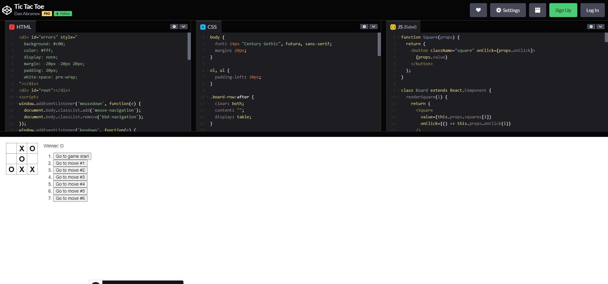

# 🕹️ React Tic-Tac-Toe

This is a practice project following the tutorial from the official [React documentation](https://reactjs.org/tutorial/tutorial.html)

Here I have learned to use things like create-react-app, useState, handleFunctions, onClick, React.component, class Component, function Component

I really enjoyed doing this project because it is very easy but at the same time you learn a lot about the basic use of React

